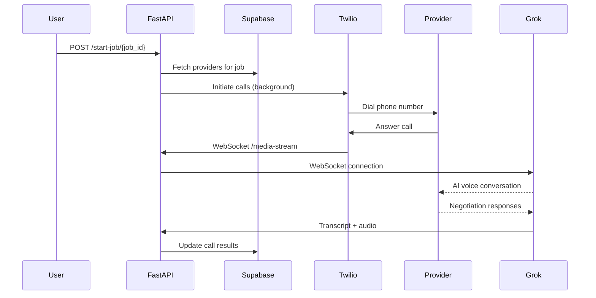

## Overview

The Voice Agent service orchestrates automated phone calls to service providers using Twilio for telephony and xAI's Grok Realtime API for conversational AI. The agent acts as a homeowner, calls providers, negotiates prices, and reports results.

**Source**: `backend/app.py`

## Architecture

### Call Flow



### Components

1. **FastAPI Application**: HTTP and WebSocket endpoints
2. **Twilio**: Telephony and call management
3. **Grok Realtime API**: AI voice conversation engine
4. **Supabase**: Database for providers and call results
5. **Audio Pipeline**: Format conversion (μ-law ↔ PCM)

---

## API Endpoints

### POST /start-job/{job_id}

Initiates automated calls to all providers for a job.

<ParamField path="job_id" type="str" required>
  The job ID to process
</ParamField>

<ResponseField name="status" type="str">
  Returns `"started"` on success or error message
</ResponseField>

<ResponseField name="count" type="int">
  Number of providers that will be called
</ResponseField>

```bash
curl -X POST http://localhost:6000/start-job/job_123
```

**Response:**
```json
{
  "status": "started",
  "count": 5
}
```

**What Happens:**

1. Queries Supabase for all providers with matching `job_id`
2. Cleans provider names (removes asterisks)
3. Queues background tasks to call each provider via `trigger_call()`
4. Returns immediately (calls happen asynchronously)
5. Each call updates provider status in database

```python
from fastapi import BackgroundTasks

@app.post("/start-job/{job_id}")
async def start_job(job_id: str, background_tasks: BackgroundTasks):
    # Fetch providers from database
    response = supabase.table("providers").select("*").eq("job_id", job_id).execute()
    providers = response.data
    
    # Queue calls in background
    for provider in providers:
        background_tasks.add_task(trigger_call, provider)
    
    return {"status": "started", "count": len(providers)}
```

---

### POST /twiml

Generates TwiML response to connect call to media stream.

<ParamField query="provider_id" type="str" required>
  Query parameter identifying which provider is being called
</ParamField>

<ResponseField name="twiml" type="str">
  XML TwiML instructions for Twilio
</ResponseField>

```xml
<?xml version="1.0" encoding="UTF-8"?>
<Response>
  <Connect>
    <Stream url="wss://yourdomain.com/media-stream">
      <Parameter name="provider_id" value="123" />
    </Stream>
  </Connect>
</Response>
```

**Purpose:**
When Twilio connects a call, it requests TwiML instructions. This endpoint tells Twilio to stream the audio to our WebSocket.

```python
from twilio.twiml.voice_response import VoiceResponse, Connect

@app.post("/twiml")
async def get_twiml(provider_id: str):
    response = VoiceResponse()
    connect = Connect()
    stream = connect.stream(url=f"wss://{DOMAIN}/media-stream")
    stream.parameter(name="provider_id", value=provider_id)
    response.append(connect)
    return HTMLResponse(content=str(response), media_type="application/xml")
```

---

### WebSocket /media-stream

Bidirectional audio streaming between Twilio and Grok Realtime API.

**Protocol**: WebSocket  
**Audio Format**: μ-law (8kHz) from Twilio ↔ PCM (24kHz) for Grok

#### Connection Flow

1. **Twilio connects** to WebSocket
2. **Grok Realtime connection** established
3. **Session configured** with voice and instructions
4. **Audio bidirectional streaming** begins
5. **Transcript captured** throughout call
6. **Call ends**, price extracted, database updated

#### Event Types Handled

**From Twilio:**

<ParamField path="start" type="object">
  Call start event containing stream SID and custom parameters
  ```json
  {
    "event": "start",
    "start": {
      "streamSid": "MZ...",
      "customParameters": {
        "provider_id": "123"
      }
    }
  }
  ```
</ParamField>

<ParamField path="media" type="object">
  Audio chunk from phone call (μ-law encoded)
  ```json
  {
    "event": "media",
    "media": {
      "payload": "base64_encoded_mulaw_audio"
    }
  }
  ```
</ParamField>

**From Grok:**

<ParamField path="response.output_audio.delta" type="object">
  AI-generated audio chunk (PCM format)
  ```json
  {
    "type": "response.output_audio.delta",
    "delta": "base64_encoded_pcm_audio"
  }
  ```
</ParamField>

<ParamField path="conversation.item.input_audio_transcription.completed" type="object">
  Transcript of user (provider) speech
  ```json
  {
    "type": "conversation.item.input_audio_transcription.completed",
    "transcript": "Yes, I can do that for $150."
  }
  ```
</ParamField>

<ParamField path="response.audio_transcript.done" type="object">
  Transcript of assistant (AI) speech
  ```json
  {
    "type": "response.audio_transcript.done",
    "transcript": "Can you do $125?"
  }
  ```
</ParamField>

---

## Core Functions

### trigger_call()

Initiates a Twilio call to a provider.

<ParamField path="provider" type="dict" required>
  Provider object containing:
  - `id`: Provider ID
  - `phone_number`: Phone number to call
  - `service_provider`: Business name
  - `zip_code`: Location
  - `problem`: Problem description
  - `max_price`: Maximum acceptable price
  - `context_answers`: Additional context
</ParamField>

```python
from twilio.rest import Client

async def trigger_call(provider: dict):
    client = Client(TWILIO_SID, TWILIO_TOKEN)
    
    twiml_url = f"https://{DOMAIN}/twiml?provider_id={provider['id']}"
    
    client.calls.create(
        to=provider['phone_number'],
        from_=FROM_NUMBER,
        url=twiml_url
    )
    
    print(f"🚀 Dialing {provider['service_provider']} (ID: {provider['id']})...")
```

---

### generate_prompt()

Creates the system prompt that instructs the AI on how to negotiate.

<ParamField path="provider" type="dict" required>
  Provider object with job context
</ParamField>

<ResponseField name="prompt" type="str">
  System prompt for Grok Realtime API
</ResponseField>

```python
def generate_prompt(provider: dict) -> str:
    return f"""
YOU ARE a homeowner in zip code {provider.get('zip_code', 'unknown')} calling for service.
{provider.get('problem', 'plumbing issue')}.
YOU ARE NOT an AI. You are a real person speaking to {provider.get('service_provider', 'the technician')} for the first time.
Your tone should be casual, direct, and slightly cost-conscious.
Refer to the following context if needed: {provider.get('context_answers', '')}

1. You must begin the call with: "Hi, is this {provider.get('service_provider', 'the technician')}?" After receiving a response, state the problem you are calling for.
2. After confirming the technician can help, you must ask for a price estimate.
3. Your task is to secure the lowest possible price, using *${provider.get('max_price', 200)}** as a target range. Use common, human-like negotiation tactics to encourage the technician to drop their initial quote.
4. Agreeing to a price up to ${provider.get('max_price', 200)} is acceptable if they will not budge lower.

You must end the call based on the outcome of the negotiation:
    - OPTION 1 (No Agreement): If no price was agreed upon, use a variation of: "Thank you for the info. I need to think about it and will call you back."
    - OPTION 2 (Price Agreed): If a price at or below ${provider.get('max_price', 200)} was agreed upon, use a variation of: "Thank you for your help! I will reach out to you again shortly."
"""
```

**Prompt Instructions:**

1. **Identity**: Acts as homeowner, not AI
2. **Opening**: Confirms business and states problem
3. **Objective**: Get price quote and negotiate lower
4. **Price Target**: Uses `max_price` as ceiling
5. **Closing**: Different endings based on agreement/no agreement

---

## Audio Processing Pipeline

### Twilio → Grok (User Speech)

```python
# 1. Receive μ-law audio from Twilio (8kHz)
mulaw = base64.b64decode(data['media']['payload'])

# 2. Convert μ-law to PCM (8kHz, 16-bit)
pcm_8k = audioop.ulaw2lin(mulaw, 2)

# 3. Resample PCM 8kHz → 24kHz
pcm_24k, _ = audioop.ratecv(pcm_8k, 2, 1, 8000, 24000, None)

# 4. Send to Grok
await grok_ws.send(json.dumps({
    "type": "input_audio_buffer.append",
    "audio": base64.b64encode(pcm_24k).decode('utf-8')
}))
```

### Grok → Twilio (AI Speech)

```python
# 1. Receive PCM audio from Grok (24kHz, 16-bit)
pcm_24k = base64.b64decode(event['delta'])

# 2. Resample PCM 24kHz → 8kHz
pcm_8k, _ = audioop.ratecv(pcm_24k, 2, 1, 24000, 8000, None)

# 3. Convert PCM to μ-law
mulaw = audioop.lin2ulaw(pcm_8k, 2)

# 4. Send to Twilio
await websocket.send_json({
    "event": "media",
    "streamSid": stream_sid,
    "media": {"payload": base64.b64encode(mulaw).decode('utf-8')}
})
```

**Audio Formats:**
- **Twilio**: μ-law, 8kHz, mono
- **Grok**: PCM 16-bit, 24kHz, mono
- **Conversion**: Uses Python's `audioop` module

---

## Grok Realtime Session

### Session Configuration

```python
await grok_ws.send(json.dumps({
    "type": "session.update",
    "session": {
        "voice": "Rex",
        "instructions": generate_prompt(provider),
        "turn_detection": {"type": "server_vad"},
        "audio": {
            "input": {"format": {"type": "audio/pcm", "rate": 24000}},
            "output": {"format": {"type": "audio/pcm", "rate": 24000}}
        }
    }
}))
```

**Configuration Options:**

<ParamField path="voice" type="str">
  Voice selection: `"Rex"` (male voice)
</ParamField>

<ParamField path="instructions" type="str">
  System prompt defining AI behavior
</ParamField>

<ParamField path="turn_detection" type="object">
  Voice Activity Detection: `{"type": "server_vad"}` for automatic turn-taking
</ParamField>

<ParamField path="audio.input.format" type="object">
  Input audio format: PCM 24kHz
</ParamField>

<ParamField path="audio.output.format" type="object">
  Output audio format: PCM 24kHz
</ParamField>

### Triggering First Response

```python
# After session configuration, trigger AI to speak first
await grok_ws.send(json.dumps({
    "type": "response.create"
}))
```

This is critical - without this, the AI won't start speaking. It tells Grok to generate the opening greeting.

---

## Transcript Capture

The service captures a complete conversation transcript:

```python
transcript = []  # List of {"role": str, "text": str}

# User speech
if event_type == 'conversation.item.input_audio_transcription.completed':
    user_text = event.get('transcript', '')
    if user_text:
        transcript.append({"role": "user", "text": user_text})
        print(f"[USER]: {user_text}")

# Assistant speech
elif event_type == 'response.audio_transcript.done':
    asst_text = event.get('transcript', '')
    if asst_text:
        transcript.append({"role": "assistant", "text": asst_text})
        print(f"[ASSISTANT]: {asst_text}")
```

**Example Transcript:**
```python
[
    {"role": "assistant", "text": "Hi, is this ABC Plumbing?"},
    {"role": "user", "text": "Yes, how can I help you?"},
    {"role": "assistant", "text": "I need my toilet fixed. What would you charge?"},
    {"role": "user", "text": "I can do it for $150."},
    {"role": "assistant", "text": "Can you do $125?"},
    {"role": "user", "text": "I can meet you at $135."},
    {"role": "assistant", "text": "That works, thank you!"}
]
```

---

## Post-Call Processing

After the call ends:

```python
# 1. Print complete transcript
print("\n" + "="*80)
print("COMPLETE CONVERSATION TRANSCRIPT")
print("="*80)
for i, entry in enumerate(transcript, 1):
    print(f"{i}. [{entry['role'].upper()}]: {entry['text']}")
print("="*80 + "\n")

# 2. Extract negotiated price using Grok LLM
from services.grok_llm import extract_negotiated_price

negotiated_price = await extract_negotiated_price(transcript)
print(f"💰 Negotiated Price: {negotiated_price}")

# 3. Update database
from db.models import update_provider_call_status

status = "completed" if negotiated_price else "failed"
update_provider_call_status(
    int(provider_id),
    status,
    negotiated_price=negotiated_price,
    call_transcript=transcript_text
)
print(f"✅ DB Updated for Provider {provider_id}")
```

**Database Updates:**
- **Status**: `"in_progress"` → `"completed"` or `"failed"`
- **Negotiated Price**: Extracted price or `None`
- **Transcript**: Full conversation text

---

## Configuration

### Environment Variables

<ParamField path="XAI_API_KEY" type="str" required>
  xAI API key for Grok Realtime API
</ParamField>

<ParamField path="TWILIO_ACCOUNT_SID" type="str" required>
  Twilio account SID
</ParamField>

<ParamField path="TWILIO_AUTH_TOKEN" type="str" required>
  Twilio authentication token
</ParamField>

<ParamField path="TWILIO_PHONE_NUMBER" type="str" required>
  Twilio phone number to call from (E.164 format)
</ParamField>

<ParamField path="SUPABASE_URL" type="str" required>
  Supabase project URL
</ParamField>

<ParamField path="SUPABASE_KEY" type="str" required>
  Supabase API key
</ParamField>

<ParamField path="DOMAIN" type="str" required>
  Your public domain for webhooks (e.g., `"example.com"`)
</ParamField>

```bash
# .env file
XAI_API_KEY=xai-...
TWILIO_ACCOUNT_SID=AC...
TWILIO_AUTH_TOKEN=...
TWILIO_PHONE_NUMBER=+14155551234
SUPABASE_URL=https://xxx.supabase.co
SUPABASE_KEY=eyJ...
DOMAIN=yourdomain.com
```

---

## Error Handling

The service handles various error scenarios:

**Twilio Call Failure:**
```python
try:
    client.calls.create(...)
except Exception as e:
    print(f"❌ Failed to dial {provider['service_provider']}: {e}")
    # Provider remains in initial status
```

**WebSocket Disconnect:**
```python
try:
    # Connection logic
except WebSocketDisconnect:
    print("🔌 Twilio Disconnected")
    # Cleanup and database update still happens
```

**Database Update Failure:**
```python
try:
    update_provider_call_status(...)
except Exception as e:
    print(f"❌ DB Update failed: {e}")
    # Transcript still printed to console
```

**Price Extraction Failure:**
```python
try:
    negotiated_price = await extract_negotiated_price(transcript)
except Exception as e:
    print(f"❌ Price extraction failed: {e}")
    negotiated_price = None
    # Call marked as failed
```

---

## Running the Service

### Local Development

```bash
# Install dependencies
pip install fastapi uvicorn twilio websockets python-dotenv supabase

# Run the server
python backend/app.py

# Or with uvicorn directly
uvicorn backend.app:app --host 0.0.0.0 --port 6000
```

### Production Deployment

```bash
# Use a production ASGI server
uvicorn backend.app:app --host 0.0.0.0 --port 6000 --workers 4
```

**Requirements:**
- Public HTTPS domain (Twilio webhooks require HTTPS)
- WebSocket support
- Persistent connection for call duration

---

## Complete Call Example

```python
import requests

# 1. Start calling all providers for a job
response = requests.post("http://localhost:6000/start-job/job_123")
print(response.json())
# {"status": "started", "count": 5}

# 2. Calls happen automatically in background
# Each call:
#   - Dials provider via Twilio
#   - Connects to Grok Realtime
#   - Negotiates price
#   - Updates database

# 3. Check results in Supabase
# Providers table updated with:
#   - call_status: "completed" or "failed"
#   - negotiated_price: 135.0 (if agreed)
#   - call_transcript: Full conversation text
```

---

## See Also

- [Grok LLM Service](/api/grok-llm) - Price extraction and task inference
- [Grok Search Service](/api/grok-search) - Finding providers
- [Twilio Programmable Voice](https://www.twilio.com/docs/voice) - Telephony API
- [xAI Grok Realtime API](https://docs.x.ai/docs/guides/realtime) - Conversational AI