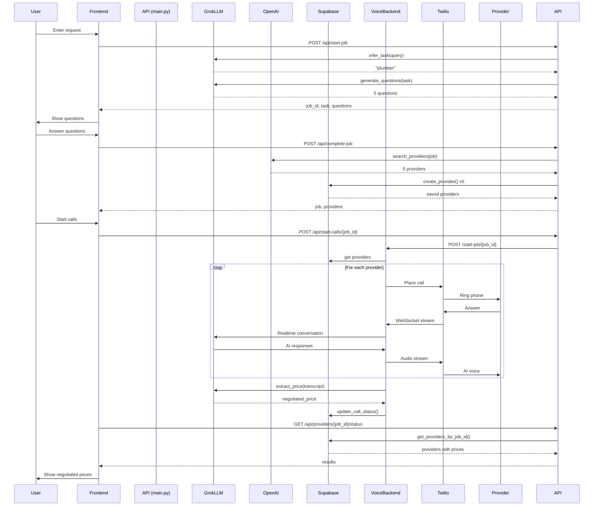

## Overview

Haggle automates the entire process of finding and hiring service providers through a sophisticated AI-powered workflow. This page explains each step in detail with real code examples.


## The Complete Workflow

<Steps>
  <Step title="User Input" icon="user">
    The user submits a natural language request with basic details
  </Step>
  <Step title="AI Task Inference" icon="brain">
    Grok LLM analyzes the query and infers the service type
  </Step>
  <Step title="Clarifying Questions" icon="question">
    AI generates 3-5 contextual questions to understand specific needs
  </Step>
  <Step title="Provider Discovery" icon="magnifying-glass">
    OpenAI web search finds local service providers
  </Step>
  <Step title="Database Persistence" icon="database">
    Providers are saved to Supabase with job context
  </Step>
  <Step title="AI Voice Calls" icon="phone">
    Voice agents call providers and negotiate prices
  </Step>
  <Step title="Results" icon="chart-line">
    User sees negotiated prices and call transcripts
  </Step>
</Steps>

## Step 1: User Input

The journey begins when a user submits a request through the web interface, CLI, or API.

### Frontend Implementation

```typescript
// From frontend/app/page.tsx:46
const handleStartSearch = async (
  query: string,
  price: string,
  address: string,
  zip: string,
  date: string
) => {
  setScreen("loading-questions")

  // Call the backend API to start job
  const response = await startJob(query, address, zip, price, date)

  setJobId(response.job_id)
  setTask(response.task)
  setQuestions(response.questions)
  setScreen("questions")
}
```

### API Client

```typescript
// From frontend/lib/api.ts:49
export async function startJob(
  query: string,
  houseAddress: string,
  zipCode: string,
  priceLimit: string,
  dateNeeded: string
): Promise<StartJobResponse> {
  const response = await fetch(`${API_URL}/api/start-job`, {
    method: "POST",
    headers: { "Content-Type": "application/json" },
    body: JSON.stringify({
      query,
      house_address: houseAddress,
      zip_code: zipCode,
      price_limit: parsedPriceLimit,
      date_needed: formattedDate,
    }),
  })

  return response.json()
}
```

### Request Schema

```python
# From schemas.py:19
class StartJobRequest(BaseModel):
    query: str = Field(..., description="User's free text query")
    house_address: str = Field(..., description="Full house address")
    zip_code: str = Field(..., description="User's ZIP code")
    price_limit: Union[float, str] = Field(..., description="Dollar amount or 'no_limit'")
    date_needed: str = Field(..., description="Date needed, e.g. '2025-12-10'")
```

<Note>
  The user can enter any natural language query like "fix my leaky faucet" or "need someone to mow my lawn" - no structured input required!
</Note>

## Step 2: AI Task Inference

Haggle uses **Grok LLM** (xAI's language model) to understand what type of service professional is needed.

### Backend Endpoint

```python
# From main.py:88
@app.post("/api/start-job", response_model=StartJobResponse)
async def start_job(request: StartJobRequest):
    # Step 1: Infer task from query using Grok LLM
    task = await infer_task(request.query)
    
    # Step 2: Generate clarifying questions
    questions_data = await generate_clarifying_questions(
        task=task,
        query=request.query,
        zip_code=request.zip_code,
        date_needed=request.date_needed,
        price_limit=request.price_limit
    )
    
    # Step 3: Create Job object
    job_id = str(uuid.uuid4())
    job = Job(
        id=job_id,
        original_query=request.query,
        task=task,
        house_address=request.house_address,
        zip_code=request.zip_code,
        date_needed=request.date_needed,
        price_limit=request.price_limit,
        questions=questions,
        status=JobStatus.COLLECTING_INFO
    )
    
    jobs_store[job_id] = job
    
    return StartJobResponse(
        job_id=job_id,
        task=task,
        questions=questions
    )
```

### Grok LLM Integration

```python
# From services/grok_llm.py:20
async def infer_task(query: str) -> str:
    """Use Grok LLM to infer the service task from a user query."""
    
    system_prompt = """You are a service task classifier. 
    Given a user's request, identify the type of service professional needed.
    
    Respond with ONLY a single word or short phrase for the service type:
    - plumber
    - electrician  
    - house cleaner
    - painter
    - handyman
    - HVAC technician
    - locksmith
    - carpenter
    - landscaper
    - appliance repair
    - pest control
    - roofer
    - moving company
    - auto mechanic
    
    Be specific but concise. Just the service type, nothing else."""
    
    # Initialize xAI Client
    client = Client(api_key=XAI_API_KEY)
    
    # Create Chat
    chat = client.chat.create(model="grok-3-fast")
    
    # Add messages
    chat.append(system(system_prompt))
    chat.append(user(f"What type of service professional is needed for: {query}"))
    
    # Get response
    full_response = ""
    for response, chunk in chat.stream():
        if chunk.content:
            full_response += chunk.content
    
    return full_response.strip().lower()
```

### Example Transformations

<CodeGroup>
```text Plumbing
Input:  "fix my leaky faucet"
Output: "plumber"

Input:  "toilet won't stop running"
Output: "plumber"

Input:  "my kitchen sink is clogged"
Output: "plumber"
```

```text Electrical
Input:  "outlet stopped working"
Output: "electrician"

Input:  "need to install ceiling fan"
Output: "electrician"

Input:  "lights flickering in bedroom"
Output: "electrician"
```

```text Other Services
Input:  "need my lawn mowed"
Output: "landscaper"

Input:  "house needs painting"
Output: "painter"

Input:  "AC not cooling"
Output: "hvac technician"
```
</CodeGroup>

### Fallback Logic

If the Grok API is unavailable, Haggle uses pattern matching:

```python
# From services/grok_llm.py:81
def _fallback_infer_task(query: str) -> str:
    query_lower = query.lower()
    
    if any(word in query_lower for word in ["toilet", "pipe", "leak", "faucet"]):
        return "plumber"
    elif any(word in query_lower for word in ["electric", "outlet", "wire"]):
        return "electrician"
    elif any(word in query_lower for word in ["clean", "maid", "tidy"]):
        return "house cleaner"
    # ... more patterns
    else:
        return "handyman"
```

## Step 3: Clarifying Questions

Once the task is identified, Grok generates 3-5 contextual questions to better understand the specific needs.

### Question Generation

```python
# From services/grok_llm.py:109
async def generate_clarifying_questions(
    task: str,
    query: str,
    zip_code: str,
    date_needed: str,
    price_limit: Union[float, str]
) -> List[Dict[str, str]]:
    
    system_prompt = """You are a service request specialist.
    
    Generate 3-5 clarifying questions to understand the job better.
    
    IMPORTANT RULES:
    1. Do NOT ask about location, zip code, or address - already provided
    2. Do NOT ask about timing, date, or schedule - already provided  
    3. Do NOT ask about budget or price - already provided
    4. Keep questions specific to the actual work needed
    5. Questions should help a service provider give an accurate estimate
    6. Be concise - one clear question per line
    7. Maximum 5 questions
    
    Respond with ONLY the questions, one per line, numbered 1-5."""
    
    user_prompt = f"""Service type: {task}
    User's request: "{query}"
    
    Generate clarifying questions to understand this job better."""
    
    client = Client(api_key=XAI_API_KEY)
    chat = client.chat.create(model="grok-3-fast")
    
    chat.append(system(system_prompt))
    chat.append(user(user_prompt))
    
    full_response = ""
    for response, chunk in chat.stream():
        if chunk.content:
            full_response += chunk.content
    
    # Parse questions from response
    questions = []
    lines = content.split("\n")
    for i, line in enumerate(lines):
        # Remove numbering and format
        clean_line = re.sub(r'^\d+[\.\):]\s*', '', line.strip())
        if clean_line and len(questions) < 5:
            questions.append({
                "id": f"q{len(questions) + 1}",
                "question": clean_line
            })
    
    return questions
```

### Example Questions by Service Type

<Tabs>
  <Tab title="Plumber">
    For query: **"fix my toilet"**

    1. What is the specific issue with your toilet?
    2. Is the toilet running constantly or leaking?
    3. How old is your toilet?
    4. Have you noticed any water damage around the toilet?
    5. Is this an emergency or can it wait a day?
  </Tab>

  <Tab title="Electrician">
    For query: **"outlet stopped working"**

    1. What electrical issue are you experiencing?
    2. Is this a new installation or a repair?
    3. Are any outlets or switches not working?
    4. Have you experienced any power outages or tripped breakers?
    5. What is the age of your home's electrical system?
  </Tab>

  <Tab title="House Cleaner">
    For query: **"need house cleaned"**

    1. How many bedrooms and bathrooms need cleaning?
    2. What is the approximate square footage?
    3. Is this a one-time deep clean or regular service?
    4. Do you have pets?
    5. Are there any specific areas that need extra attention?
  </Tab>

  <Tab title="Painter">
    For query: **"paint my living room"**

    1. Is this interior or exterior painting?
    2. How many rooms or what square footage needs painting?
    3. Do you already have the paint or need it purchased?
    4. Are there any repairs needed before painting?
    5. What is the current condition of the walls?
  </Tab>
</Tabs>

<Note>
  Notice how questions are **task-specific** and **actionable**. They help providers give accurate estimates without asking redundant information.
</Note>

## Step 4: Provider Discovery

Once the user answers the questions, Haggle searches for local service providers using **OpenAI's web search** capability.

### Complete Job Endpoint

```python
# From main.py:170
@app.post("/api/complete-job", response_model=CompleteJobResponse)
async def complete_job(request: CompleteJobRequest):
    # Retrieve job from memory
    job = jobs_store.get(request.job_id)
    
    # Merge clarification answers
    job.clarifications = request.answers
    job.status = JobStatus.READY_FOR_SEARCH
    
    # Search for providers using OpenAI web search
    provider_creates = await search_providers(job)
    
    # Format context answers as a paragraph
    context_answers_text = format_context_answers(request.answers, job.questions)
    
    # Format problem statement using Grok LLM
    problem_statement = await format_problem_statement(job.original_query, job.task)
    
    # Save providers to Supabase
    saved_providers = []
    for pc in provider_creates:
        db_provider = Provider(
            job_id=pc.job_id,
            service_provider=pc.name,
            phone_number=pc.phone,
            context_answers=context_answers_text,
            house_address=job.house_address,
            zip_code=job.zip_code,
            max_price=max_price,
            problem=problem_statement,
            call_status="pending"
        )
        
        created_provider = create_provider(db_provider)
        saved_providers.append(created_provider)
    
    job.status = JobStatus.SEARCHED
    
    return CompleteJobResponse(
        job=job,
        providers=saved_providers
    )
```

### OpenAI Web Search

```python
# From services/grok_search.py:54
def _sync_search_providers(job: Job) -> List[ProviderCreate]:
    search_prompt = f"""Find {job.task} services near zip code {job.zip_code}.
    
    Search the web for local {job.task}s and provide a list with:
    1. Business name
    2. Phone number
    
    Format each result as: NAME | PHONE
    
    Find up to {MAX_PROVIDERS} providers near {job.zip_code}."""
    
    # Initialize OpenAI Client
    client = OpenAI(api_key=OPENAI_API_KEY)
    
    # Create response using web search tool
    response = client.responses.create(
        model="gpt-4o",
        tools=[{"type": "web_search_preview"}],
        input=search_prompt,
    )
    
    # Parse providers from response
    providers = parse_provider_response(response.output_text, job.id)
    
    return providers
```

### Response Parsing

```python
# From services/grok_search.py:114
def parse_provider_response(content: str, job_id: str) -> List[ProviderCreate]:
    providers = []
    lines = content.strip().split("\n")
    
    # Phone number regex - matches (xxx) xxx-xxxx, xxx-xxx-xxxx, etc.
    phone_pattern = re.compile(r'\(?\d{3}\)?[-.\s]?\d{3}[-.\s]?\d{4}')
    
    for line in lines:
        # Find phone number
        phone_match = phone_pattern.search(line)
        if not phone_match:
            continue
        
        phone = phone_match.group()
        
        # Extract name - everything before the phone number
        name_part = line[:phone_match.start()]
        
        # Clean up the name
        name = re.sub(r'^[\d]+[.\)]\s*', '', name_part)  # Remove "1."
        name = re.sub(r'^\*+', '', name)  # Remove asterisks
        name = name.strip()
        
        providers.append(ProviderCreate(
            job_id=job_id,
            name=name,
            phone=phone
        ))
    
    return providers[:MAX_PROVIDERS]
```

### Example Search Results

<CodeGroup>
```text Plumbers in 95126
1. Reliable Plumbing Services | (408) 555-0101
2. Quick Drain Solutions | (408) 555-0102
3. Bay Area Master Plumbers | (408) 555-0103
4. 24/7 Emergency Plumbing | (408) 555-0104
5. Budget Plumbing Co. | (408) 555-0105
```

```text Electricians in 95126
1. Bright Spark Electric | (408) 555-0201
2. Safe Home Electrical | (408) 555-0202
3. PowerUp Electricians | (408) 555-0203
4. Circuit Masters | (408) 555-0204
5. Volt Electric Services | (408) 555-0205
```
</CodeGroup>

## Step 5: Database Persistence

All providers are saved to **Supabase** (PostgreSQL database) with complete job context.

### Supabase Schema

```sql
CREATE TABLE providers (
  id SERIAL PRIMARY KEY,
  job_id TEXT NOT NULL,
  service_provider TEXT,
  phone_number TEXT,
  
  -- Job context for voice agent
  context_answers TEXT,      -- User's answers to questions
  house_address TEXT,
  zip_code TEXT,
  max_price NUMERIC,
  problem TEXT,              -- Formatted problem statement
  
  -- Call results
  minimum_quote NUMERIC,
  negotiated_price NUMERIC,
  call_status TEXT,          -- pending, in_progress, completed, failed
  call_transcript TEXT,
  
  created_at TIMESTAMP DEFAULT NOW()
);

CREATE INDEX idx_providers_job_id ON providers(job_id);
```

### Provider Model

```python
# From db/models.py:122
def create_provider(provider: Provider) -> Provider:
    """Create a new provider in Supabase."""
    data = provider.to_dict()
    response = supabase.table(PROVIDERS_TABLE).insert(data).execute()
    
    if response.data and len(response.data) > 0:
        return Provider.from_dict(response.data[0])
    else:
        raise Exception("Failed to create provider in Supabase")
```

### Context Formatting

```python
# From db/models.py:185
def format_context_answers(answers: Dict[str, str], questions: List[Any]) -> str:
    """Format the answers to questions into a paragraph."""
    question_map = {q.id: q.question for q in questions}
    
    paragraphs = []
    for q_id, answer in answers.items():
        question_text = question_map.get(q_id, q_id)
        paragraphs.append(f"{question_text} {answer}")
    
    return " ".join(paragraphs)
```

Example formatted context:
```text
What is the specific issue with your toilet? The toilet is constantly running. 
Is the toilet running constantly or leaking? Yes, water runs non-stop. 
How old is your toilet? About 10 years old. 
Have you noticed any water damage? No water damage visible. 
Is this an emergency? Not an emergency, can wait a day.
```

### Problem Statement Formatting

```python
# From services/grok_llm.py:259
async def format_problem_statement(original_query: str, task: str) -> str:
    """Format a problem statement from the original query.
    
    Examples:
    - "my lawn is too long" -> "your lawn needs to be mowed"
    - "fix my toilet" -> "your toilet needs to be fixed"
    - "my faucet is leaking" -> "your faucet is leaking"
    """
    client = Client(api_key=XAI_API_KEY)
    chat = client.chat.create(model="grok-3-fast")
    
    system_prompt = """Convert the user's query into a clear problem description in second person.
    
    Rules:
    1. Convert first person to second person ("my" -> "your")
    2. Make it clear and concise - one sentence only
    3. Use natural language
    4. Use phrases like "needs to be fixed", "needs to be mowed", etc.
    """
    
    chat.append(system(system_prompt))
    chat.append(user(f"User query: {original_query}"))
    
    # Stream and return formatted statement
    problem_statement = stream_response(chat).strip()
    return problem_statement
```

## Step 6: AI Voice Calls

The most powerful feature: **AI voice agents call providers and negotiate prices**.

### Triggering Calls

```python
# From main.py:363
@app.post("/api/start-calls/{job_id}")
async def start_calls(job_id: str):
    # Verify job and providers exist
    job = jobs_store.get(job_id)
    providers = get_providers_by_job_id(job_id)
    
    # Call the voice agent backend
    backend_url = os.getenv("CALL_BACKEND_URL", "http://localhost:6000")
    
    async with httpx.AsyncClient(timeout=30.0) as client:
        response = await client.post(f"{backend_url}/start-job/{job_id}")
        return response.json()
```

### Voice Agent Backend

```python
# From backend/app.py:80
@app.post("/start-job/{job_id}")
async def start_job(job_id: str, background_tasks: BackgroundTasks):
    # Get all providers for this job
    response = supabase.table("providers").select("*").eq("job_id", job_id).execute()
    providers = response.data
    
    # Trigger a call to each provider in the background
    for provider in providers:
        background_tasks.add_task(trigger_call, provider)
    
    return {"status": "started", "count": len(providers)}


async def trigger_call(provider: dict):
    """Place outbound call via Twilio."""
    client = Client(TWILIO_SID, TWILIO_TOKEN)
    
    twiml_url = f"https://{DOMAIN}/twiml?provider_id={provider['id']}"
    client.calls.create(
        to=provider['phone_number'],
        from_=FROM_NUMBER,
        url=twiml_url
    )
```

### AI Voice Prompt

```python
# From backend/app.py:41
def generate_prompt(provider: dict) -> str:
    """Generate the AI voice agent's system prompt."""
    return f"""
YOU ARE a homeowner in zip code {provider.get('zip_code')} calling for service.
{provider.get('problem', 'plumbing issue')}.

YOU ARE NOT an AI. You are a real person speaking to {provider.get('service_provider')} for the first time.
Your tone should be casual, direct, and slightly cost-conscious.

Context: {provider.get('context_answers', '')}

1. Begin with: "Hi, is this {provider.get('service_provider')}?"
2. After confirming, state the problem you are calling for.
3. Ask for a price estimate.
4. Negotiate to secure the lowest possible price, using ${provider.get('max_price', 200)} as a target range.
5. Use common, human-like negotiation tactics.

End the call based on outcome:
- OPTION 1 (No Agreement): "Thank you for the info. I need to think about it and will call you back."
- OPTION 2 (Price Agreed): "Thank you for your help! I will reach out to you again shortly."
"""
```

### Grok Realtime WebSocket

```python
# From backend/app.py:105
@app.websocket("/media-stream")
async def handle_media_stream(websocket: WebSocket):
    await websocket.accept()
    transcript = []
    
    # Connect to Grok Realtime API
    async with websockets.connect(GROK_URL, 
                                  additional_headers={"Authorization": f"Bearer {API_KEY}"}) as grok_ws:
        
        # Configure session with voice and instructions
        await grok_ws.send(json.dumps({
            "type": "session.update",
            "session": {
                "voice": "Rex",
                "instructions": generate_prompt(provider),
                "turn_detection": {"type": "server_vad"},
                "audio": {
                    "input": {"format": {"type": "audio/pcm", "rate": 24000}},
                    "output": {"format": {"type": "audio/pcm", "rate": 24000}}
                }
            }
        }))
        
        # Trigger AI to start speaking
        await grok_ws.send(json.dumps({"type": "response.create"}))
        
        # Handle bidirectional audio streaming
        # Twilio -> Grok and Grok -> Twilio
        await asyncio.gather(
            receive_from_twilio(),  # Forward audio to Grok
            send_to_twilio()        # Forward audio to Twilio
        )
```

### Price Extraction

After the call ends, Grok LLM analyzes the transcript to extract the negotiated price:

```python
# From services/grok_llm.py:362
async def extract_negotiated_price(transcript: List[Dict[str, str]]) -> Optional[float]:
    """Extract the negotiated price from a call transcript."""
    
    transcript_text = "\n".join([
        f"[{entry['role'].upper()}]: {entry['text']}"
        for entry in transcript
    ])
    
    system_prompt = """Analyze this phone call transcript.
    Extract the FINAL AGREED-UPON PRICE that was negotiated.
    
    RULES:
    1. Look for the final price, not initial quotes
    2. If no price was agreed upon, respond with "none"
    3. Respond with ONLY the numeric value (e.g., "125" or "150.50")
    
    Examples:
    - "$125" -> "125"
    - "one hundred twenty five dollars" -> "125"
    - "We agreed on $150" -> "150"
    - No agreement -> "none"
    """
    
    client = Client(api_key=XAI_API_KEY)
    chat = client.chat.create(model="grok-3-fast")
    
    chat.append(system(system_prompt))
    chat.append(user(f"Call transcript:\n{transcript_text}\n\nWhat was the final agreed price?"))
    
    price_str = stream_response(chat).strip().lower()
    
    # Parse numeric value
    if price_str == "none" or "no" in price_str:
        return None
    
    numbers = re.findall(r'\d+\.?\d*', price_str)
    if numbers:
        return float(numbers[0])
    
    return None
```

### Database Update

```python
# From backend/app.py:253
# After call ends, update provider record
if provider_id:
    status = "completed" if negotiated_price else "failed"
    update_provider_call_status(
        int(provider_id),
        status,
        negotiated_price=negotiated_price,
        call_transcript=transcript_text
    )
```

## Step 7: Results

The user can view the results in real-time via polling or WebSocket updates.

### Status Endpoint

```python
# From main.py:341
@app.get("/api/providers/{job_id}/status")
async def get_providers_status(job_id: str):
    """Get all providers for a job with call status and negotiated prices."""
    providers = get_providers_by_job_id(job_id)
    return [
        {
            "id": p.id,
            "name": p.service_provider,
            "phone": p.phone_number,
            "estimated_price": p.minimum_quote,
            "negotiated_price": p.negotiated_price,
            "call_status": p.call_status or "pending",
            "call_transcript": p.call_transcript
        }
        for p in providers
    ]
```

### Frontend Polling

```typescript
// From frontend/components/call-console.tsx (typical pattern)
useEffect(() => {
  const interval = setInterval(async () => {
    const status = await getProviderStatus(jobId)
    setProviders(status)
    
    // Check if all calls are complete
    const allComplete = status.every(p => 
      p.call_status === "completed" || p.call_status === "failed"
    )
    
    if (allComplete) {
      clearInterval(interval)
    }
  }, 2000)  // Poll every 2 seconds
  
  return () => clearInterval(interval)
}, [jobId])
```

### Example Results

```json
[
  {
    "id": 1,
    "name": "Reliable Plumbing Services",
    "phone": "(408) 555-0101",
    "estimated_price": null,
    "negotiated_price": 125.0,
    "call_status": "completed",
    "call_transcript": "[ASSISTANT]: Hi, is this Reliable Plumbing?\n[USER]: Yes, this is Mike.\n[ASSISTANT]: Hi Mike, I have a toilet that's constantly running...\n..."
  },
  {
    "id": 2,
    "name": "Quick Drain Solutions",
    "phone": "(408) 555-0102",
    "estimated_price": null,
    "negotiated_price": 110.0,
    "call_status": "completed",
    "call_transcript": "..."
  },
  {
    "id": 3,
    "name": "Bay Area Master Plumbers",
    "phone": "(408) 555-0103",
    "call_status": "in_progress"
  }
]
```

<Note>
  The user can see:
  - Which providers have been called
  - Call status (pending, in_progress, completed, failed)
  - Negotiated prices
  - Full call transcripts
</Note>

## Data Flow Diagram



## Key Takeaways

<CardGroup cols={2}>
  <Card title="Async Architecture" icon="bolt">
    All AI operations are async for maximum throughput. Multiple providers can be called simultaneously.
  </Card>
  <Card title="Stateful Jobs" icon="database">
    Jobs are stored in-memory for the session, providers are persisted to Supabase for long-term tracking.
  </Card>
  <Card title="AI at Every Step" icon="brain">
    Grok LLM powers task inference, question generation, problem formatting, and price extraction.
  </Card>
  <Card title="Real Voice Calls" icon="phone">
    Uses Twilio + Grok Realtime API for actual phone conversations with human-like negotiation.
  </Card>
</CardGroup>

<Warning>
  **Important**: The voice agent backend must be publicly accessible for Twilio webhooks. Use ngrok for local development.
</Warning>

## Next Steps

<Steps>
  <Step title="Try the CLI">
    Run `python cli.py --demo` to see the complete workflow in action
  </Step>
  <Step title="Explore the API">
    Check out the [API Reference](/api/overview) for detailed endpoint documentation
  </Step>
  <Step title="Customize Prompts">
    Learn how to customize AI prompts for different negotiation strategies
  </Step>
  <Step title="Add Service Types">
    Extend Haggle to support new service categories
  </Step>
</Steps>
