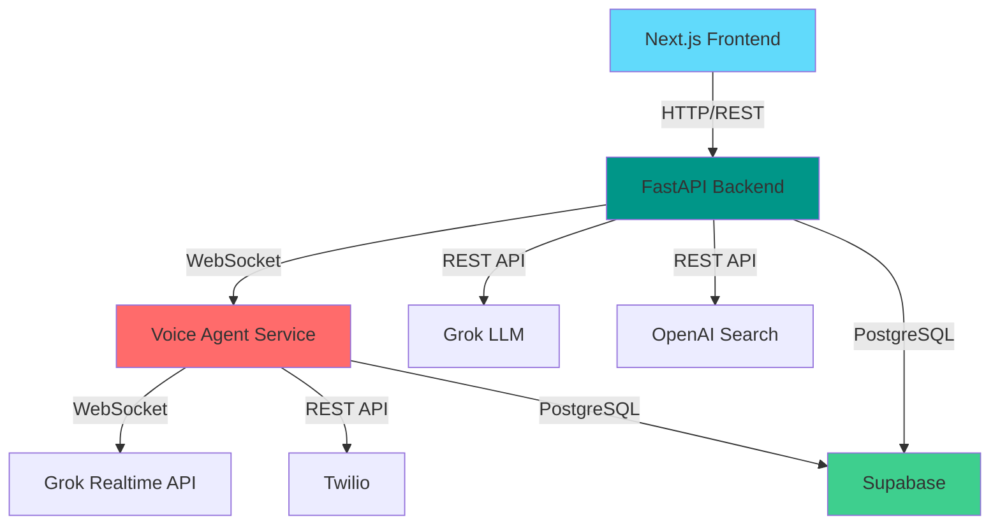

## Overview

Haggle is built on a modern, three-tier architecture combining FastAPI, Next.js, and Supabase. The platform uses AI-powered voice agents to negotiate with service providers on behalf of homeowners.

<Note>
  The system is designed for high scalability and real-time voice communication using WebSocket connections.
</Note>

## Architecture Diagram



## Core Components

<AccordionGroup>
  <Accordion title="Frontend Layer (Next.js)">
    **Technology Stack:**
    - Next.js 16.0.7 (React 19.2.0)
    - TypeScript
    - Tailwind CSS 4.1.9
    - Radix UI components
    - Shadcn/ui component library

    **Key Features:**
    - Server-side rendering (SSR)
    - Client-side state management
    - Real-time provider status polling
    - Responsive UI with gradient backgrounds

    **Main Components:**
    - `landing-page.tsx` - Initial search interface
    - `questions-flow.tsx` - AI-generated clarifying questions
    - `call-console.tsx` - Real-time call monitoring dashboard

    **Location:** `/workspace/source/frontend/`
  </Accordion>

  <Accordion title="API Layer (FastAPI)">
    **Technology Stack:**
    - FastAPI (Python)
    - Uvicorn ASGI server
    - Pydantic for data validation
    - CORS middleware for frontend integration

    **Main Endpoints:**

    | Endpoint | Method | Description |
    |----------|--------|-------------|
    | `/api/start-job` | POST | Initiates job with AI task inference |
    | `/api/complete-job` | POST | Searches providers and saves to DB |
    | `/api/providers/{job_id}` | GET | Retrieves providers for a job |
    | `/api/providers/{job_id}/status` | GET | Polls call status and prices |
    | `/api/start-calls/{job_id}` | POST | Triggers voice agent calls |

    **Port:** 8000

    **Location:** `/workspace/source/main.py`
  </Accordion>

  <Accordion title="Voice Agent Service">
    **Technology Stack:**
    - FastAPI with WebSocket support
    - Twilio Voice API
    - Grok Realtime API (WebSocket)
    - Audio processing (audioop, base64)

    **Audio Processing Pipeline:**
    ```python
    # Twilio -> Grok
    μ-law (8kHz) -> PCM (8kHz) -> PCM (24kHz) -> Base64 -> Grok
    
    # Grok -> Twilio
    Grok -> Base64 -> PCM (24kHz) -> PCM (8kHz) -> μ-law (8kHz) -> Twilio
    ```

    **Real-time Features:**
    - Bidirectional audio streaming
    - Live transcript capture
    - AI-powered negotiation
    - Automatic price extraction

    **Port:** 6000

    **Location:** `/workspace/source/backend/app.py`
  </Accordion>

  <Accordion title="Database Layer (Supabase)">
    **Technology Stack:**
    - PostgreSQL (via Supabase)
    - Row Level Security (RLS)
    - Real-time subscriptions (optional)

    **Primary Table:** `providers`

    **Features:**
    - Automatic indexing on job_id, zip_code
    - BIGSERIAL primary keys
    - NUMERIC for precise price storage
    - Timestamp tracking with `created_at`

    **Location:** `/workspace/source/db/models.py`
  </Accordion>
</AccordionGroup>

## Request Flow

### Job Creation Flow

<Steps>
  <Step title="User Submits Query">
    User enters free-text query (e.g., "fix my toilet") with location and budget details via the Next.js frontend.
  </Step>

  <Step title="Task Inference">
    FastAPI calls Grok LLM to infer service type:
    ```python
    task = await infer_task(query)  # Returns: "plumber"
    ```
  </Step>

  <Step title="Generate Questions">
    Grok LLM generates 3-5 clarifying questions based on task type:
    ```python
    questions = await generate_clarifying_questions(
        task=task,
        query=query,
        zip_code=zip_code,
        date_needed=date_needed,
        price_limit=price_limit
    )
    ```
  </Step>

  <Step title="Store Job in Memory">
    Job object created with UUID and stored in in-memory dict:
    ```python
    job_id = str(uuid.uuid4())
    jobs_store[job_id] = Job(...)  # Not persisted to DB
    ```
  </Step>

  <Step title="Return to Frontend">
    API returns `job_id`, `task`, and `questions` to frontend for display.
  </Step>
</Steps>

### Provider Search Flow

<Steps>
  <Step title="Submit Answers">
    User answers clarifying questions. Frontend calls `/api/complete-job`.
  </Step>

  <Step title="Search Providers">
    OpenAI Web Search API finds local service providers:
    ```python
    response = client.responses.create(
        model="gpt-4o",
        tools=[{"type": "web_search_preview"}],
        input=search_prompt
    )
    ```
  </Step>

  <Step title="Parse Results">
    Extract provider names and phone numbers using regex:
    ```python
    phone_pattern = re.compile(r'\(?\d{3}\)?[-.\s]?\d{3}[-.\s]?\d{4}')
    ```
  </Step>

  <Step title="Save to Supabase">
    Each provider saved to `providers` table with job context:
    ```python
    db_provider = Provider(
        job_id=job_id,
        service_provider=name,
        phone_number=phone,
        context_answers=answers_text,
        house_address=address,
        zip_code=zip_code,
        max_price=max_price,
        problem=problem_statement,
        call_status="pending"
    )
    create_provider(db_provider)
    ```
  </Step>
</Steps>

### Voice Call Flow

<Steps>
  <Step title="Trigger Calls">
    Frontend calls `/api/start-calls/{job_id}`, which calls backend service on port 6000.
  </Step>

  <Step title="Initiate Twilio Calls">
    Backend fetches providers from Supabase and triggers parallel calls:
    ```python
    for provider in providers:
        background_tasks.add_task(trigger_call, provider)
    ```
  </Step>

  <Step title="Connect to Grok Realtime">
    Twilio WebSocket connects to backend, which opens WebSocket to Grok:
    ```python
    async with websockets.connect(GROK_URL, 
        additional_headers={"Authorization": f"Bearer {API_KEY}"}) as grok_ws:
    ```
  </Step>

  <Step title="Stream Audio Bidirectionally">
    Two async tasks run in parallel:
    - `receive_from_twilio()`: Converts Twilio audio to Grok format
    - `send_to_twilio()`: Converts Grok audio to Twilio format
  </Step>

  <Step title="Capture Transcript">
    Real-time transcript captured from Grok events:
    ```python
    if event_type == 'conversation.item.input_audio_transcription.completed':
        transcript.append({"role": "user", "text": user_text})
    elif event_type == 'response.audio_transcript.done':
        transcript.append({"role": "assistant", "text": asst_text})
    ```
  </Step>

  <Step title="Extract Price & Update DB">
    After call ends, Grok LLM extracts negotiated price:
    ```python
    negotiated_price = await extract_negotiated_price(transcript)
    update_provider_call_status(
        provider_id,
        "completed",
        negotiated_price=negotiated_price,
        call_transcript=transcript_text
    )
    ```
  </Step>
</Steps>

## Data Flow

<CodeGroup>
```json Job Object (In-Memory)
{
  "id": "550e8400-e29b-41d4-a716-446655440000",
  "original_query": "fix my toilet",
  "task": "plumber",
  "house_address": "123 Main St, San Jose, CA 95126",
  "zip_code": "95126",
  "date_needed": "2025-12-10",
  "price_limit": 250,
  "clarifications": {
    "q1": "The toilet is constantly running",
    "q2": "Yes, water runs non-stop"
  },
  "questions": [
    {"id": "q1", "question": "What is the specific issue?"},
    {"id": "q2", "question": "Is water actively leaking?"}
  ],
  "status": "searched"
}
```

```json Provider Record (Supabase)
{
  "id": 1,
  "job_id": "550e8400-e29b-41d4-a716-446655440000",
  "service_provider": "Reliable Plumbing Services",
  "phone_number": "(408) 555-0101",
  "context_answers": "What is the specific issue? The toilet is constantly running",
  "house_address": "123 Main St, San Jose, CA 95126",
  "zip_code": "95126",
  "max_price": 250.00,
  "minimum_quote": null,
  "problem": "your toilet needs to be fixed",
  "call_status": "completed",
  "negotiated_price": 175.00,
  "call_transcript": "[USER]: Yes, hello...\n[ASSISTANT]: Hi, is this Reliable Plumbing...",
  "created_at": "2025-12-10T10:30:00Z"
}
```
</CodeGroup>

## Session Management

<Warning>
  Jobs are stored **in-memory only** and do not persist to the database. In production, use Redis or similar for session storage.
</Warning>

```python
# In-memory storage (main.py:57)
jobs_store: Dict[str, Job] = {}

# Jobs are temporary - only providers persist
```

**Why this design?**
- Jobs are ephemeral session data
- Providers are the only persistent entities
- Reduces database writes
- Simplifies data model

## Scalability Considerations

<CardGroup cols={2}>
  <Card title="Horizontal Scaling" icon="arrows-left-right">
    - FastAPI backend is stateless (except jobs_store)
    - Voice agent service can run multiple instances
    - Supabase handles connection pooling
  </Card>

  <Card title="Async Processing" icon="bolt">
    - All I/O operations are async (httpx, websockets)
    - Parallel background tasks for calling providers
    - Non-blocking audio streaming
  </Card>

  <Card title="Database Optimization" icon="database">
    - Indexed queries on job_id and zip_code
    - BIGSERIAL for high-volume inserts
    - Prepared statements via Supabase client
  </Card>

  <Card title="Error Handling" icon="shield-check">
    - Fallback providers when APIs fail
    - Graceful degradation for missing API keys
    - Comprehensive exception handling in voice flow
  </Card>
</CardGroup>

## Environment Configuration

Required environment variables:

```bash .env
# AI Services
XAI_API_KEY=your_xai_api_key_here
OPENAI_API_KEY=your_openai_api_key_here
OPENAI_ORG_API_KEY=your_org_key_here  # Optional

# Database
SUPABASE_URL=https://your-project.supabase.co
SUPABASE_KEY=your_supabase_anon_key

# Twilio
TWILIO_ACCOUNT_SID=your_twilio_sid
TWILIO_AUTH_TOKEN=your_twilio_token
TWILIO_PHONE_NUMBER=+1234567890

# Deployment
DOMAIN=your-domain.com  # For Twilio webhooks
CALL_BACKEND_URL=http://localhost:6000  # Voice agent service
```

## Deployment Architecture

<Tabs>
  <Tab title="Development">
    Run all services locally:
    
    ```bash
    # Terminal 1: FastAPI backend
    cd /workspace/source
    uvicorn main:app --reload --port 8000
    
    # Terminal 2: Voice agent service
    cd /workspace/source/backend
    python app.py  # Runs on port 6000
    
    # Terminal 3: Next.js frontend
    cd /workspace/source/frontend
    npm run dev  # Runs on port 3000
    ```
  </Tab>

  <Tab title="Production">
    **Recommended Stack:**
    - **Frontend**: Vercel (Next.js native)
    - **API Backend**: Railway, Render, or AWS ECS
    - **Voice Service**: Railway or Render (WebSocket support required)
    - **Database**: Supabase (managed PostgreSQL)
    - **Domain**: Cloudflare for DNS and SSL

    **Key Requirements:**
    - WebSocket support for voice service
    - Public HTTPS endpoint for Twilio webhooks
    - Environment variables configured in each service
  </Tab>
</Tabs>

## Performance Metrics

| Metric | Target | Notes |
|--------|--------|-------|
| API Response Time | < 2s | Task inference + question generation |
| Provider Search | < 5s | OpenAI web search latency |
| Call Initiation | < 1s | Twilio API call |
| Audio Latency | < 300ms | Round-trip audio processing |
| Transcript Accuracy | > 95% | Grok Realtime API transcription |
| Price Extraction | > 90% | LLM-based parsing accuracy |

## Technology Choices

<AccordionGroup>
  <Accordion title="Why FastAPI?">
    - Native async/await support for I/O-heavy operations
    - Automatic OpenAPI documentation
    - Pydantic validation out of the box
    - Excellent performance (comparable to Node.js)
    - WebSocket support for real-time features
  </Accordion>

  <Accordion title="Why Next.js?">
    - Server-side rendering for SEO
    - File-based routing
    - TypeScript support
    - Vercel deployment optimization
    - Rich component ecosystem (Radix UI)
  </Accordion>

  <Accordion title="Why Supabase?">
    - PostgreSQL with managed infrastructure
    - Row Level Security for multi-tenant apps
    - Real-time subscriptions (future feature)
    - Python client library
    - Free tier for development
  </Accordion>

  <Accordion title="Why Grok Realtime API?">
    - Low-latency voice conversations
    - Built-in VAD (Voice Activity Detection)
    - Streaming audio transcription
    - Customizable voice and instructions
    - WebSocket-based for bidirectional audio
  </Accordion>
</AccordionGroup>