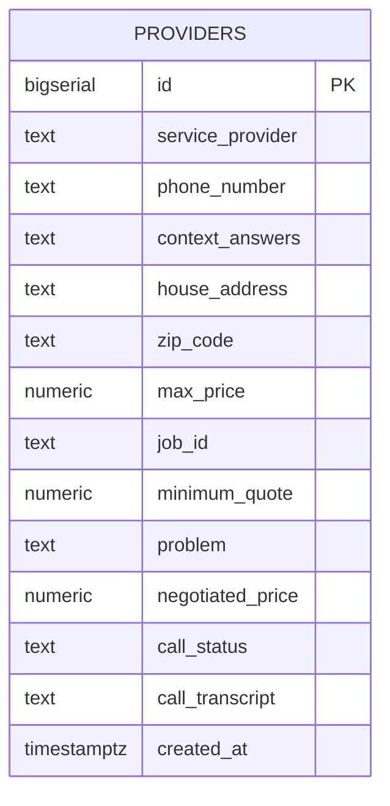

## Overview

Haggle uses **Supabase** (managed PostgreSQL) for persistent storage. The schema is minimal by design - only service providers are persisted, while job sessions remain in-memory.

<Note>
  The database uses PostgreSQL-specific features like BIGSERIAL, NUMERIC, and Row Level Security (RLS).
</Note>

## Schema Diagram



## Tables

### providers

Stores service provider information discovered via AI search and negotiation outcomes.

<CodeGroup>
```sql Schema Definition
CREATE TABLE IF NOT EXISTS providers (
    id BIGSERIAL PRIMARY KEY,
    service_provider TEXT NOT NULL,
    phone_number TEXT,
    context_answers TEXT,
    house_address TEXT,
    zip_code TEXT,
    max_price NUMERIC(10, 2),
    job_id TEXT NOT NULL,
    minimum_quote NUMERIC(10, 2),
    problem TEXT,
    negotiated_price NUMERIC(10, 2),
    call_status TEXT,
    call_transcript TEXT,
    created_at TIMESTAMP WITH TIME ZONE DEFAULT NOW()
);
```

```sql Indexes
-- Performance optimization for common queries
CREATE INDEX IF NOT EXISTS idx_providers_job_id ON providers(job_id);
CREATE INDEX IF NOT EXISTS idx_providers_zip_code ON providers(zip_code);
CREATE INDEX IF NOT EXISTS idx_providers_service_provider ON providers(service_provider);
CREATE INDEX IF NOT EXISTS idx_providers_house_address ON providers(house_address);
```

```sql Row Level Security
-- Enable RLS for security
ALTER TABLE providers ENABLE ROW LEVEL SECURITY;

-- Development policy (replace in production)
CREATE POLICY "Allow all operations for anon users" ON providers
    FOR ALL
    USING (true)
    WITH CHECK (true);
```
</CodeGroup>

## Column Reference

<ParamField path="id" type="BIGSERIAL" required>
  Auto-incrementing primary key. Uses BIGSERIAL for high-volume inserts.
</ParamField>

<ParamField path="service_provider" type="TEXT" required>
  Business name of the service provider (e.g., "Reliable Plumbing Services").
  
  <Warning>May contain trailing asterisks from search results. Backend strips these before calling.</Warning>
</ParamField>

<ParamField path="phone_number" type="TEXT">
  Provider's phone number in various formats:
  - `(408) 555-0101`
  - `408-555-0101`
  - `408.555.0101`
  
  Extracted via regex: `r'\(?\d{3}\)?[-.\s]?\d{3}[-.\s]?\d{4}'`
</ParamField>

<ParamField path="context_answers" type="TEXT">
  Formatted paragraph of user's answers to clarifying questions.
  
  **Example:**
  ```
  What is the specific issue with your toilet? The toilet is constantly running. 
  Is the toilet running constantly or leaking? Yes, water runs non-stop. 
  How old is your toilet? About 10 years old.
  ```
  
  Used in AI agent prompt for context-aware negotiation.
</ParamField>

<ParamField path="house_address" type="TEXT">
  Full address provided by user (e.g., "123 Main St, San Jose, CA 95126").
  
  Not used for search (zip_code is used instead), but stored for record-keeping.
</ParamField>

<ParamField path="zip_code" type="TEXT">
  5-digit ZIP code used for provider search.
  
  <Info>Indexed for fast filtering by location.</Info>
</ParamField>

<ParamField path="max_price" type="NUMERIC(10, 2)">
  Maximum budget user is willing to pay. Used by AI agent during negotiation.
  
  **Example values:**
  - `250.00` (user set $250 limit)
  - `NULL` ("no_limit" option selected)
</ParamField>

<ParamField path="job_id" type="TEXT" required>
  UUID linking provider to the originating job session.
  
  **Format:** UUID v4 (e.g., `550e8400-e29b-41d4-a716-446655440000`)
  
  <Note>Jobs are NOT stored in the database - only in memory. This field is for grouping providers.</Note>
</ParamField>

<ParamField path="minimum_quote" type="NUMERIC(10, 2)">
  Initial price estimate from provider (if obtained during search).
  
  <Warning>Currently unused - reserved for future feature where providers submit quotes.</Warning>
</ParamField>

<ParamField path="problem" type="TEXT">
  AI-formatted problem statement in second person.
  
  **Examples:**
  - `"your toilet needs to be fixed"`
  - `"your lawn needs to be mowed"`
  - `"your faucet is leaking"`
  
  Generated by `format_problem_statement()` in `services/grok_llm.py`
</ParamField>

<ParamField path="negotiated_price" type="NUMERIC(10, 2)">
  Final agreed-upon price after AI negotiation.
  
  **Extraction logic:**
  ```python
  negotiated_price = await extract_negotiated_price(transcript)
  # Uses Grok LLM to parse conversation transcript
  ```
  
  `NULL` if no agreement reached.
</ParamField>

<ParamField path="call_status" type="TEXT">
  Current status of the negotiation call.
  
  **Valid values:**
  - `pending` - Not yet called
  - `in_progress` - Currently on call
  - `completed` - Call finished with agreement
  - `failed` - Call finished without agreement
</ParamField>

<ParamField path="call_transcript" type="TEXT">
  Full conversation transcript from the AI agent call.
  
  **Format:**
  ```
  1. [USER]: Yes, hello?
  2. [ASSISTANT]: Hi, is this Reliable Plumbing Services?
  3. [USER]: Yes, this is Mike.
  4. [ASSISTANT]: Hi Mike, I have a toilet that needs to be fixed...
  ...
  ```
  
  Captured real-time from Grok Realtime API events:
  - `conversation.item.input_audio_transcription.completed` (user)
  - `response.audio_transcript.done` (assistant)
</ParamField>

<ParamField path="created_at" type="TIMESTAMPTZ">
  Timestamp when provider record was created (defaults to NOW()).
  
  Uses `TIMESTAMP WITH TIME ZONE` for timezone-aware storage.
</ParamField>

## Python Model

The `Provider` class in `db/models.py` maps to the database table:

<CodeGroup>
```python Class Definition
class Provider:
    def __init__(
        self,
        id: Optional[int] = None,
        service_provider: Optional[str] = None,
        phone_number: Optional[str] = None,
        context_answers: Optional[str] = None,
        house_address: Optional[str] = None,
        zip_code: Optional[str] = None,
        max_price: Optional[float] = None,
        job_id: Optional[str] = None,
        minimum_quote: Optional[float] = None,
        problem: Optional[str] = None,
        negotiated_price: Optional[float] = None,
        call_status: Optional[str] = None,
        call_transcript: Optional[str] = None
    ):
        # Initialize all fields...
```

```python Create Provider
from db.models import Provider, create_provider

db_provider = Provider(
    job_id="550e8400-e29b-41d4-a716-446655440000",
    service_provider="Reliable Plumbing Services",
    phone_number="(408) 555-0101",
    context_answers="What is the specific issue? Running toilet...",
    house_address="123 Main St, San Jose, CA 95126",
    zip_code="95126",
    max_price=250.0,
    problem="your toilet needs to be fixed",
    call_status="pending"
)

created = create_provider(db_provider)
print(f"Created provider with ID: {created.id}")
```

```python Query Providers
from db.models import get_providers_by_job_id

providers = get_providers_by_job_id("550e8400-...")

for p in providers:
    print(f"{p.service_provider}: ${p.negotiated_price}")
```

```python Update Call Status
from db.models import update_provider_call_status

update_provider_call_status(
    provider_id=1,
    call_status="completed",
    negotiated_price=175.0,
    call_transcript="[USER]: Hello...\n[ASSISTANT]: Hi..."
)
```
</CodeGroup>

## Database Operations

### Common Queries

<Accordion title="Get all providers for a job">
```sql
SELECT * FROM providers 
WHERE job_id = '550e8400-e29b-41d4-a716-446655440000'
ORDER BY created_at ASC;
```

**Python equivalent:**
```python
response = supabase.table("providers").select("*").eq("job_id", job_id).execute()
providers = [Provider.from_dict(item) for item in response.data]
```
</Accordion>

<Accordion title="Get providers by location">
```sql
SELECT * FROM providers 
WHERE zip_code = '95126'
ORDER BY created_at DESC;
```

**Uses index:** `idx_providers_zip_code`
</Accordion>

<Accordion title="Get completed negotiations under budget">
```sql
SELECT service_provider, phone_number, negotiated_price 
FROM providers 
WHERE job_id = '550e8400-...'
  AND call_status = 'completed'
  AND negotiated_price <= max_price
ORDER BY negotiated_price ASC;
```

Finds successful negotiations within budget, sorted by price.
</Accordion>

<Accordion title="Update call status after negotiation">
```sql
UPDATE providers 
SET 
  call_status = 'completed',
  negotiated_price = 175.00,
  call_transcript = '[USER]: Hello...'
WHERE id = 1
RETURNING *;
```

**Python equivalent:**
```python
update_data = {
    "call_status": "completed",
    "negotiated_price": 175.0,
    "call_transcript": transcript_text
}
response = supabase.table("providers").update(update_data).eq("id", provider_id).execute()
```
</Accordion>

## Migration Files

The database schema is managed through SQL migration files:

<Tabs>
  <Tab title="Initial Schema">
    **File:** `supabase_migration.sql`
    
    Creates the base `providers` table with core fields:
    - id, service_provider, phone_number
    - context_answers, house_address, zip_code
    - max_price, job_id, minimum_quote, problem
    - created_at
    
    **Run in:** Supabase SQL Editor
  </Tab>
  
  <Tab title="Call Fields">
    **File:** `supabase_migration_call_fields.sql`
    
    Adds voice call tracking fields:
    ```sql
    ALTER TABLE providers
    ADD COLUMN negotiated_price NUMERIC(10, 2),
    ADD COLUMN call_status TEXT,
    ADD COLUMN call_transcript TEXT;
    ```
  </Tab>
  
  <Tab title="Updates">
    **File:** `supabase_migration_update.sql`
    
    Contains any schema updates or fixes applied after initial deployment.
  </Tab>
</Tabs>

## Data Lifecycle

<Steps>
  <Step title="Provider Discovery">
    OpenAI Search finds providers → Parsed → Inserted into `providers` table with `call_status = 'pending'`
  </Step>
  
  <Step title="Call Initiation">
    Backend updates `call_status = 'in_progress'` when Twilio call connects
  </Step>
  
  <Step title="Negotiation">
    Real-time transcript captured but not yet saved to DB
  </Step>
  
  <Step title="Call Completion">
    - Extract negotiated price from transcript using LLM
    - Update `call_status = 'completed'` or `'failed'`
    - Save `negotiated_price` and full `call_transcript`
  </Step>
  
  <Step title="Frontend Polling">
    Frontend polls `/api/providers/{job_id}/status` every 2-3 seconds to update UI with latest call results
  </Step>
</Steps>

## Performance Optimization

<CardGroup cols={2}>
  <Card title="Indexing Strategy" icon="magnifying-glass">
    All frequently queried columns are indexed:
    - `job_id` (most common query)
    - `zip_code` (location filtering)
    - `service_provider` (text search)
    - `house_address` (address lookup)
  </Card>
  
  <Card title="Data Types" icon="database">
    - `BIGSERIAL` for high-volume inserts
    - `NUMERIC(10, 2)` for precise money values
    - `TEXT` for unlimited string storage
    - `TIMESTAMPTZ` for timezone handling
  </Card>
  
  <Card title="Connection Pooling" icon="server">
    Supabase automatically handles connection pooling:
    - Max connections: 100+ (varies by plan)
    - Idle timeout: 10 minutes
    - Python client reuses connections
  </Card>
  
  <Card title="Minimal Writes" icon="bolt">
    Only 2 write operations per provider:
    1. INSERT on discovery
    2. UPDATE after call completion
    
    Jobs are never written to DB (in-memory only)
  </Card>
</CardGroup>

## Security

### Row Level Security (RLS)

<Warning>
  The current RLS policy allows all operations for anonymous users. **Change this in production!**
</Warning>

```sql Current Policy (Development)
CREATE POLICY "Allow all operations for anon users" ON providers
    FOR ALL
    USING (true)
    WITH CHECK (true);
```

**Recommended production policies:**

<CodeGroup>
```sql Read-Only for Anon Users
CREATE POLICY "Allow read for anon users" ON providers
    FOR SELECT
    USING (true);
```

```sql Write Only with API Key
CREATE POLICY "Allow insert for service role" ON providers
    FOR INSERT
    WITH CHECK (auth.role() = 'service_role');

CREATE POLICY "Allow update for service role" ON providers
    FOR UPDATE
    USING (auth.role() = 'service_role');
```

```sql User-Scoped Access
-- Requires adding user_id column
CREATE POLICY "Users can only see their providers" ON providers
    FOR SELECT
    USING (auth.uid() = user_id);
```
</CodeGroup>

### Data Privacy

<Accordion title="PII Storage">
  **Stored PII:**
  - House addresses
  - Phone numbers (providers, not users)
  - Call transcripts (may contain personal info)
  
  **Recommendations:**
  - Encrypt `call_transcript` at application level
  - Hash or tokenize addresses
  - Implement data retention policy (delete after 30 days)
  - Add GDPR compliance endpoints (data export, deletion)
</Accordion>

<Accordion title="API Key Security">
  Supabase keys are stored in environment variables:
  
  ```python
  SUPABASE_URL = os.getenv("SUPABASE_URL")
  SUPABASE_KEY = os.getenv("SUPABASE_KEY")  # Anon key for client-side
  ```
  
  **Best practices:**
  - Use `service_role` key only on backend
  - Rotate keys periodically
  - Never commit keys to Git
  - Use secret management (AWS Secrets Manager, etc.)
</Accordion>

## Backup & Recovery

Supabase provides automatic daily backups:

<Steps>
  <Step title="Automatic Backups">
    - **Free tier:** 7 days of backups
    - **Pro tier:** 30 days of backups
    - Point-in-time recovery (PITR) on Pro+
  </Step>
  
  <Step title="Manual Exports">
    Export via Supabase dashboard or `pg_dump`:
    ```bash
    pg_dump -h db.your-project.supabase.co \
            -U postgres \
            -d postgres \
            -t providers \
            > providers_backup.sql
    ```
  </Step>
  
  <Step title="Restoration">
    Restore from SQL file:
    ```bash
    psql -h db.your-project.supabase.co \
         -U postgres \
         -d postgres \
         < providers_backup.sql
    ```
  </Step>
</Steps>

## Future Schema Extensions

<AccordionGroup>
  <Accordion title="Users Table">
    Track user accounts and job history:
    ```sql
    CREATE TABLE users (
        id UUID PRIMARY KEY DEFAULT uuid_generate_v4(),
        email TEXT UNIQUE NOT NULL,
        created_at TIMESTAMPTZ DEFAULT NOW()
    );
    
    ALTER TABLE providers ADD COLUMN user_id UUID REFERENCES users(id);
    ```
  </Accordion>
  
  <Accordion title="Jobs Table">
    Persist job sessions to database:
    ```sql
    CREATE TABLE jobs (
        id UUID PRIMARY KEY,
        user_id UUID REFERENCES users(id),
        original_query TEXT,
        task TEXT,
        zip_code TEXT,
        status TEXT,
        created_at TIMESTAMPTZ DEFAULT NOW()
    );
    
    -- Make job_id a foreign key
    ALTER TABLE providers 
    ADD CONSTRAINT fk_job 
    FOREIGN KEY (job_id) REFERENCES jobs(id);
    ```
  </Accordion>
  
  <Accordion title="Call Analytics">
    Track negotiation metrics:
    ```sql
    CREATE TABLE call_analytics (
        id BIGSERIAL PRIMARY KEY,
        provider_id BIGINT REFERENCES providers(id),
        call_duration_seconds INT,
        negotiation_rounds INT,
        initial_quote NUMERIC(10, 2),
        final_price NUMERIC(10, 2),
        discount_percentage NUMERIC(5, 2),
        created_at TIMESTAMPTZ DEFAULT NOW()
    );
    ```
  </Accordion>
</AccordionGroup>